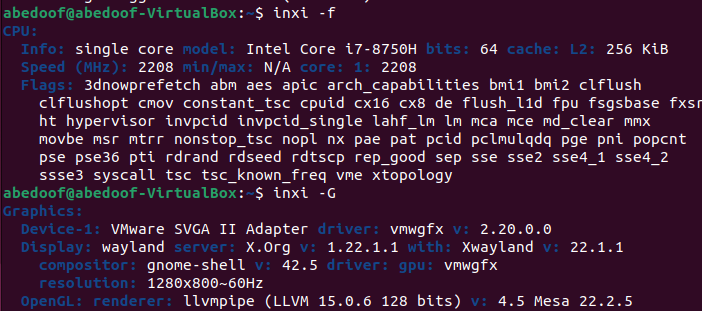
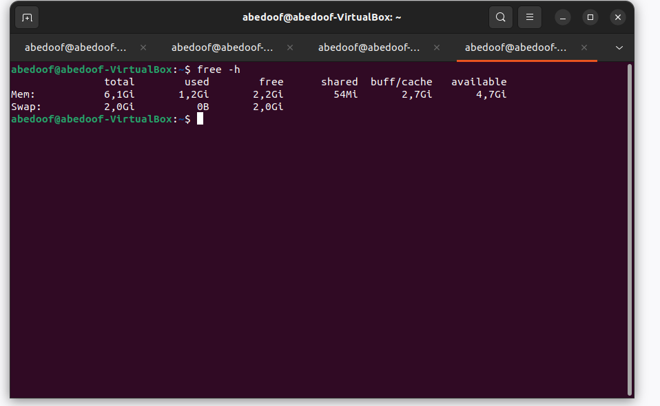
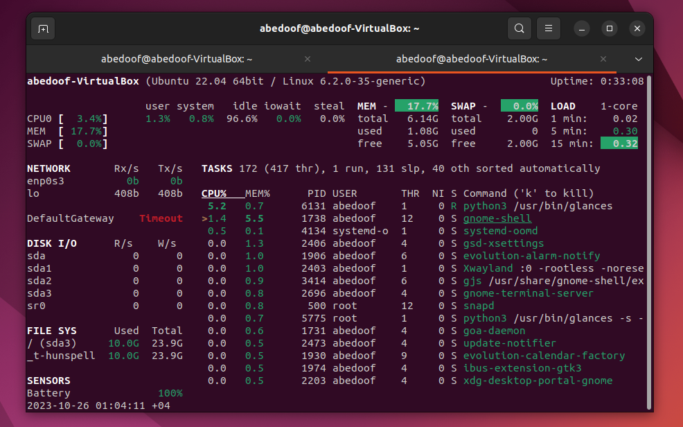
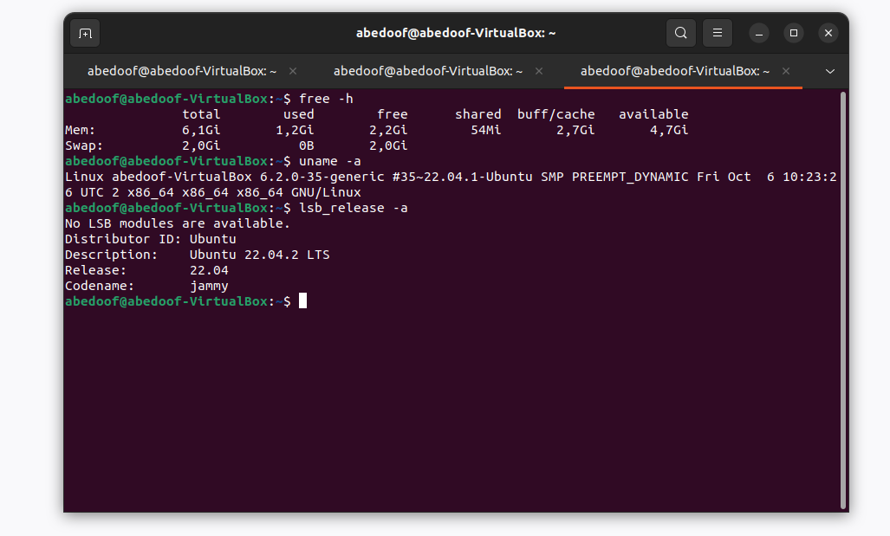

## Task 2:
### Inspecting Performance:

1. Processor, RAM, and Network Information:
 - As we all know in *Windows*, there is a built in tool called ```Dxdiag``` that shows the resources of the host machine. The situation is however different in *Ubuntu*
  - After applying some research for tool that show  processor, RAM, and network information separately.We found that there are alread command ```lscpu``` that shows the system sources, however, there are other tools online to be used.
  -  We decided to choose the ```inxi``` and install by the following commands:
   - ```sudo apt-get install inxi```
   Then we Applied ```inxi -f``` and ```inxi -G```. The output was the following: 

   ********
   
*************************************
**Also**  the command ```free -h``` shows the amount of used RAM at the given moment.

************************************************

   *********************************************

Forthermore , for the **network monitoring system***, we decied to select ```Glances``` tool for its simplicity. ```Glances``` was installed through the following process:
1. ```sudo apt install glances``` following ```glances``` command to run :

**********************

***************************

There are many other tools to be used like **hwinfo**, **lsblk**, **df -h**,
***************************

### Inspecting System:

To check the specifications of the software system itself, we choose two built-in commands that show the *kernel* version and *Ubuntu* release version.

- ```uname -a```
- ```lsb_release -a```
  
  ************************
  
  ***********************