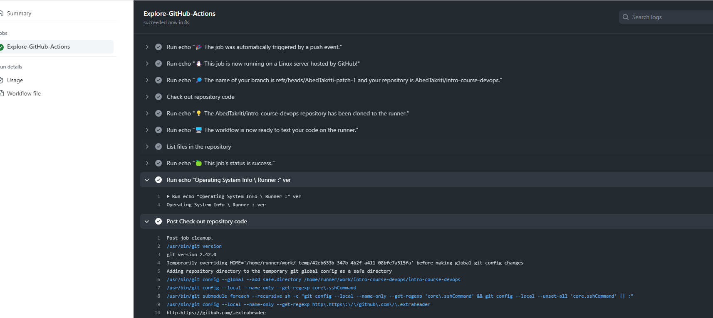

# WorkFlow Lab

In this lab, we will explore Docker and some basic commands to manage some images and containers.

## Task 1: 

In this Task we will be creating a workflow on *Github* using a ```quickstart guide```:

1. Create ```.github/workflows``` in branch ```Lab_9```

2. Inside the above directory, we will  create a file named ```github-actions-demo.yml``` and paste inside the following code: 
3. ```
    name: GitHub Actions Demo
    run-name: ${{ github.actor }} is testing out GitHub Actions 🚀
    on: [push]
    jobs:
    Explore-GitHub-Actions:
     runs-on: ubuntu-latest
     steps:
     - run: echo "🎉 The job was automatically triggered by a ${{ github.event_name }} event."
     - run: echo "🐧 This job is now running on a ${{ runner.os }} server hosted by GitHub!"
     - run: echo "🔎 The name of your branch is ${{ github.ref }} and your repository is ${{ github.repository }}."
     - name: Check out repository code
         uses: actions/checkout@v4
     - run: echo "💡 The ${{ github.repository }} repository has been cloned to the runner."
     - run: echo "🖥️ The workflow is now ready to test your code on the runner."
     - name: List files in the repository
         run: |
         ls ${{ github.workspace }}
     - run: echo "🍏 This job's status is ${{ job.status }}."
    ```


4. After committing,  the workflow **was not** triggered and i faced some errors. After Inspecting and some researching, it turned out that I should have created the workflow in the `main` branch and then committed to other branch.
5. I deleted everything and started from `main` branch.
6. After committing the changes to the repository, we select to commit on a new branch and  called it ```AbedTakriti-patch-1```. The workflow was triggered by```push``` and ran.✅ 

